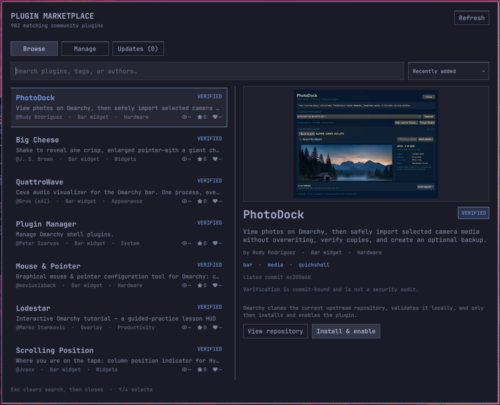

# Plugin Marketplace

A native Omarchy Quattro overlay for browsing and installing community plugins
from [Omarchy Plugins](https://omarchyplugins.com/).

## Requirements

- Omarchy Quattro with shell plugin support
- Network access to `omarchyplugins.com`, `api.omarchyplugins.com`, and GitHub
- Standard Omarchy command-line tools, including Bash, curl, Git, jq, OpenSSH,
  and coreutils

No separate dependencies or install script are required on a standard Omarchy
installation.

## Install

```sh
omarchy plugin add https://github.com/Yasino55/omarchy-plugin-marketplace.git --enable
```

Omarchy validates the repository before installing it. When prompted, choose
the bar section where the Marketplace icon should appear.

## Usage

Click the Marketplace icon in the bar, or run:

```sh
omarchy-shell shell toggle jason.marketplace '{}'
```

To add an optional `Super+M` shortcut, put this in
`~/.config/hypr/bindings.lua`:

```lua
o.bind("SUPER + M", "Plugin Marketplace", "omarchy-shell shell toggle jason.marketplace '{}'")
```

The plugin does not modify Hyprland keybindings or application-launcher files.

## Preview



The catalog is loaded from `https://omarchyplugins.com/catalog.json`. Search and
filtering happen locally. Installation is available only for entries explicitly
marked installable whose repository is a valid GitHub HTTPS URL.

Marketplace validates the repository manifest id before installing, then resumes
plugin discovery and enablement after the shell reloads its plugin registry. An
installed plugin remains marked installed even if enablement fails. Plugins that
replace the full bar are installed without activation and must be activated from
the command line so Marketplace cannot unload its own operation.

Community plugins run as unsandboxed code inside the long-running Omarchy shell.
Marketplace verification is not a security audit or a guarantee of safety.

## Updates

The Updates tab checks installed third-party Git plugins when their `origin` is
a recognizable GitHub HTTPS or SSH URL. It compares the local commit with the
remote repository's advertised `HEAD` without fetching or changing local Git
state. Checks run when Marketplace opens and when it is refreshed.

Updates are applied individually after confirmation. The checked update path
requires the local and remote commits to remain identical to those displayed,
then fast-forwards and runs Omarchy's standard plugin validation. The running
Marketplace and active full-bar plugins remain CLI only so an update cannot
unload the process performing it. A failed remote check is reported as
unavailable rather than treating the plugin as up to date.

Marketplace cannot update itself while it is running. Update it from a terminal:

```sh
omarchy plugin update jason.marketplace
```

## Icon attribution

The marketplace icon uses cable geometry from Lucide Icons under the ISC
License, copyright 2026 Lucide Icons and Contributors.

## Remove

```sh
omarchy plugin remove jason.marketplace
```
